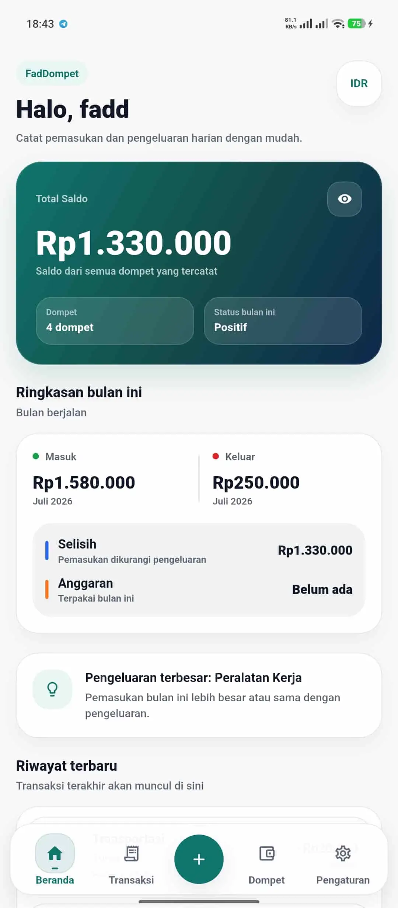
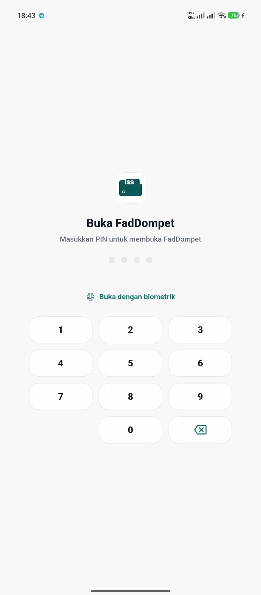
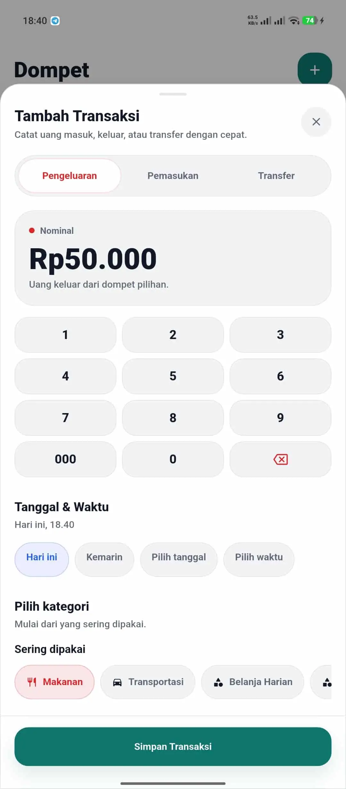
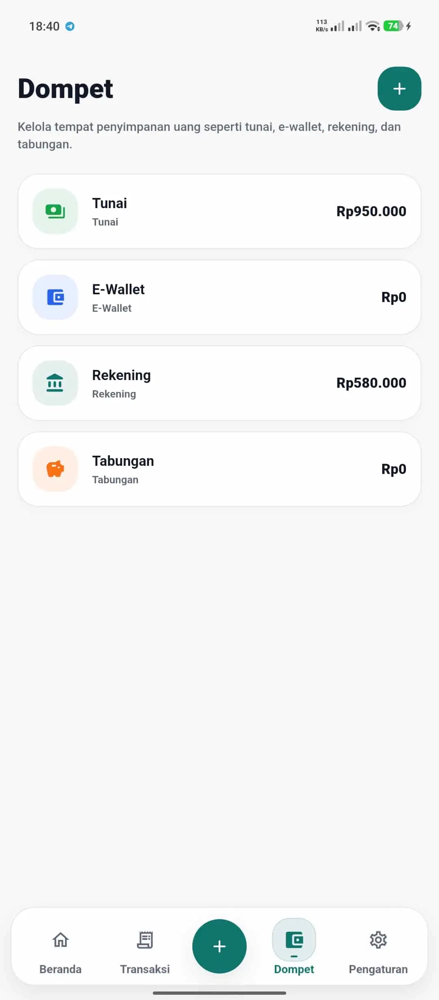
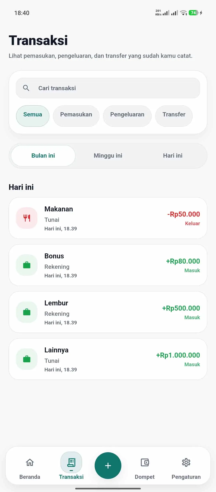
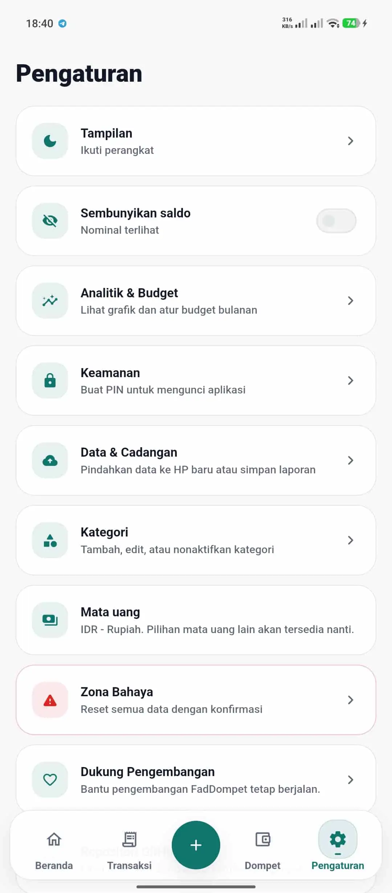
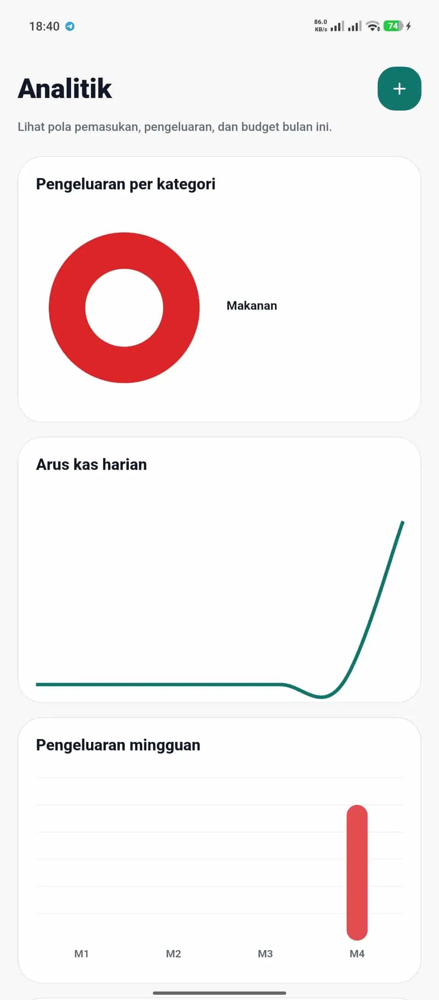

<p align="center">
  
</p>

<h1 align="center">FadDompet</h1>

<p align="center">
  Offline-first personal finance tracker for Android.
</p>

<p align="center">
  FadDompet helps users track income, expenses, wallets, budgets, backups, and app updates locally on their device.
</p>

<p align="center">
  <a href="https://github.com/fadd3079-prog/faddompet/actions/workflows/flutter-ci.yml"></a>
  
  
  <a href="LICENSE"></a>
  <a href="https://github.com/fadd3079-prog/faddompet/releases/latest"></a>
  
</p>

## Screenshots

<p align="center">
  
  
  
  
</p>

<p align="center">
  
  
  
</p>

## Features

- Income and expense tracking
- Wallet management
- Transfer between wallets
- Monthly budgets
- Analytics and summaries
- Local app lock with PIN and optional biometric unlock
- Backup and restore for moving data between phones
- CSV transaction export
- In-app update checker with direct APK download
- Offline-first local storage

## Privacy Model

- No account
- No cloud sync
- No ads
- No analytics or tracking
- Data stays on the device
- Backup files contain financial data and should be stored safely

FadDompet uses the internet only for user-triggered actions such as checking app updates, downloading an APK update, opening external links, or sharing exported files through Android.

## Download

Download the latest Android APK from GitHub Releases:

https://github.com/fadd3079-prog/faddompet/releases/latest

For most modern Android phones, use the `arm64` APK.

APK files installed from GitHub are sideloaded. Android or Play Protect may show a warning because the app is not installed from the Play Store.

## Verify APK

If a release provides a SHA256 checksum, verify the downloaded APK before installing it.

PowerShell:

```powershell
Get-FileHash .\FadDompet-vX.X.X-arm64.apk -Algorithm SHA256
```

## Build From Source

Requirements:

- Flutter stable
- Android SDK
- Java 17

Commands:

```bash
flutter pub get
flutter analyze
flutter test
flutter build apk --release --split-per-abi
```

Release signing uses a local keystore. Do not commit `android/key.properties`, `.jks`, or `.keystore` files.

For release publishing steps, see [docs/release-checklist.md](docs/release-checklist.md).

## Tech Stack

- Flutter
- Dart
- Drift
- SQLite
- Riverpod
- fl_chart
- Android

## Project Structure

```txt
lib/app       App bootstrap, theme, and providers
lib/core      Constants, enums, formatters, and helpers
lib/data      Drift database, repositories, backup, security, updates
lib/features  Feature-first UI modules
lib/shared    Shared layouts, widgets, and components
test          Unit and widget tests
android       Android host project
```

## Roadmap

- UI polish
- Backup encryption
- Better data export
- Optional database encryption
- More tests
- Possible Play Store distribution

## Contributing

See [CONTRIBUTING.md](CONTRIBUTING.md).

## AI-Assisted Development

FadDompet includes repository-level instructions for AI-assisted development. AI-generated changes must follow the same standards as human contributions: small scope, no secrets, no unnecessary permissions, and passing checks.

- [AGENTS.md](AGENTS.md)
- [AI-assisted development guide](docs/ai-assisted-development.md)

## Automated Checks

The repository uses GitHub Actions for Flutter analyze/test checks, Dependabot for dependency updates, and CodeQL for scheduled Android host-code scanning.

## Security

See [SECURITY.md](SECURITY.md).

## Support Development

If FadDompet helps you, you can support its ongoing development here:

https://tako.id/fadhol_pemula

## License

FadDompet is released under the [MIT License](LICENSE).

Copyright (c) 2026 Mufaddhol.
